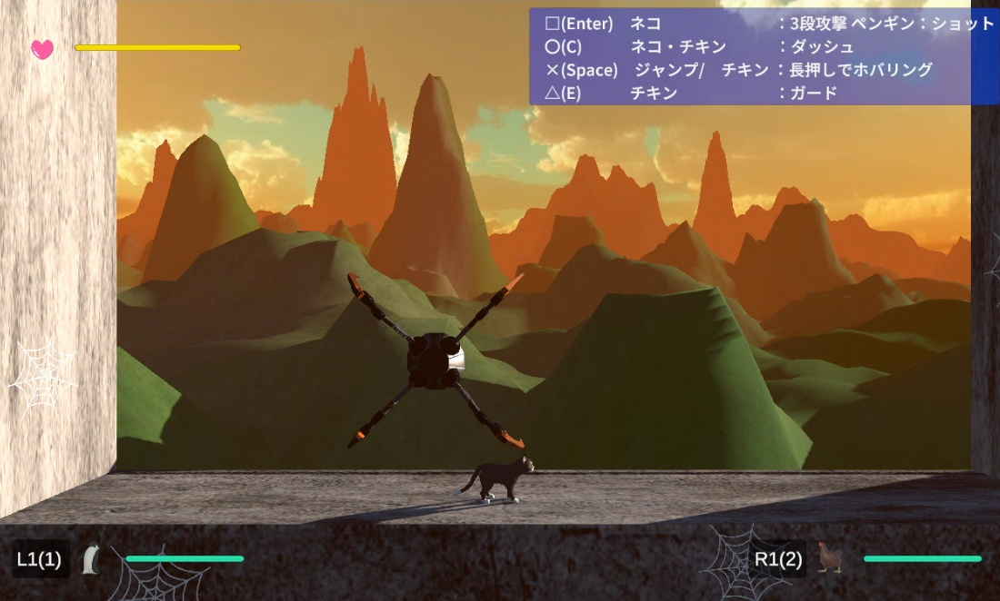
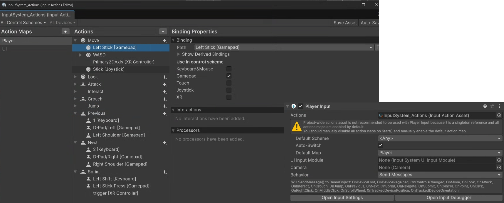
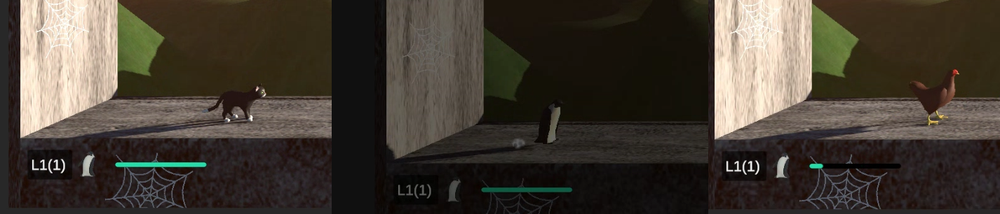
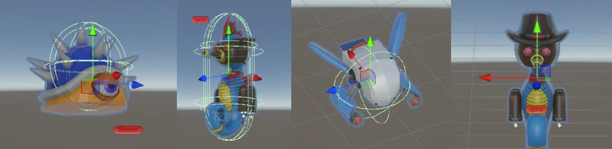
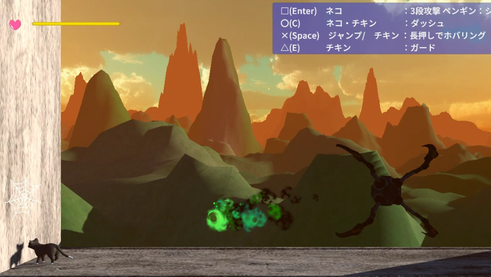
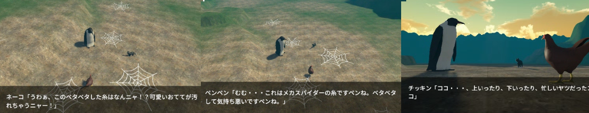
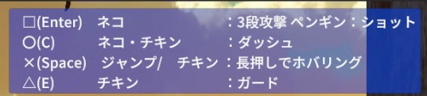
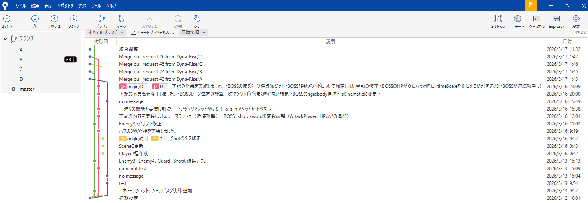
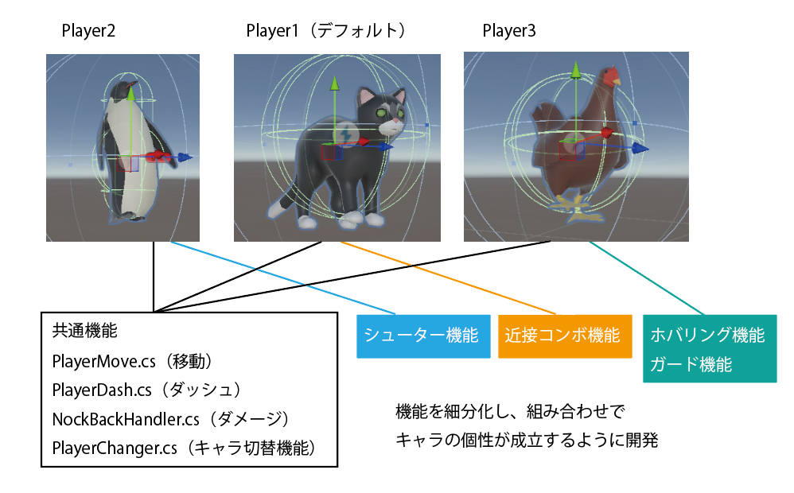

# Animal United Front

## 概要
Animal United Frontは複数人で共同開発したゲームです。  
横スクロールの3Dアクションゲームで、敵を撃破しながらステージを進んでいき  
最終的にはボスである巨大なクモを倒すゲームとなっています。

## 開発環境・仕様ツール
* Unity Editor 6000.3.5f2  
* VisualStudio2026
* Git/GitHub
* SourceTree

<Unityアセット>
* Fantasy Skybox FREE
* FreeQuickEffectsVol1
* Loply Animal
* SpiderOrange
* RPG Monster DUO PBR Polyart

## 開発期間
2026.03.13-2026.03.19 (およそ30時間)

## ゲームの特徴
### ゲームパッドに対応(InputSystem)
UnityのInputSystemを採用、PlayerにPlayerInputコンポーネントを付与して、キーボードにも、ゲームパッドにも対応できるように作っています。

### キャラを切り替えながらプレイ
InputSystemを通して特定のボタンを押すと、キャラクターが切り替わります。  
これは切り替わり用のスクリプト「PlayerChnger.cs」が反応し、あらかじめて作っておいた別キャラを前のキャラクターの座標に違和感なく置き換えることで実現しています。

### エネミーのバリエーション
Enemyは4種類のプレハブを用意しました。それぞれ動きに特徴があるので別々のスクリプトをつけています。

* 往復移動
* 投擲
* 突進
* シールドとシュート

### ボスとの戦闘
ステージの最後にはBossとの戦闘が待っています。  
Bossとは駆け引きを楽しめるように、回避に集中するタイミングと攻撃チャンスを明確にしました。  
また、接近攻撃はBossにダメージを与える大チャンスですが、その分Bossの攻撃をくらいやすいなど、リスクとリターンが両立するように設計しています。

### デモシーンの導入
ユーザーがゲームプレイに自然と入っていけるように、オープニングにストーリーシーンを追加しています。  
また、Boss撃破後もキャラクターたちがコントをすることで余韻を残し、ただ終わりではなく、ゲームをクリアしたという実感、達成感が生まれるよう配慮しました。

## ゲーム操作方法
今回はゲームパッド、キーバード、マウスなど操作の窓口が多く、またキャラクターによってもアクションがことなるので、ゲーム中にも操作方法を示すUIを表示しユーザーの混乱をおさえるように努めています。

## 開発分担
GitHubのブランチによる分担を行い、マージと差異分担を繰り返し完成をさせました。
主な作業区分けとして
* Player動作
* Enemy
* Boss
に分かれ、それぞれの担当が作業を行いました。

### Playerの特徴
Plyerの共通動作はいくつかのコンポーネントに分けています
* 左右移動/ジャンプ PlayerMove.cs
* ダッシュ受付 PlayerDash.cs
* ダメージ処理 NockBackHandler.cs
* 変身ボタンに対応してキャラチェンジ PlayerChanger.cs

それぞれのキャラは独自のアクションがあり、それぞれ独立したスクリプトで設計・アタッチをしています。
* ネコ （近接コンボ）   
特定時間内にボタンを押すことでコンボが繋がるようになります。時間計測や1段目～3段目などに異なるエフェクト(particle)が出るよう視覚的にも工夫をしています。

* ペンギン（ショット）   
アクションボタンでプレハブ化しておいたショットを出します。Player本体に触れてすぐに弾が消失しないようレイヤーなどの設定工夫があります。

* ニワトリ（ホバリング/ガード）  
特にホバリングは重力値との兼ね合いで数値調整に苦労しました。「ボタンを押しっぱなしにする」「ボタンをはなした」ということをシステムが認識 するようIputSystemの設定や数値調整には苦労をしました。

### Enemyの特徴
4種類のEnemyがおりプレハブ化して大量に配置できます。
それぞれ独自のスクリプトで動かしています。

* Enemy1 (往復運動)  
コンパクトなアルゴリズムで反復をさせるためにSin三角関数を活用するなど工夫があります。

* Enemy2（一定間隔での投擲）  
特定の方角にシュートすることに加え、一定間隔で投擲がされるよう時間計測しています。

* Enemy3（飛行と索敵範囲内でPlayerに突進）  
2つの動き（左に飛んでくる・Playerに飛んでくる）を切り替えるための索敵範囲とフラグ、また突進時にPlayerの方向を割り出す計算式など細かい工夫が必要でした。

* Enemy4（ガードと攻撃の攻防）  
一定間隔で「盾の防御」と「シュート攻撃」を繰り返します。特に盾をかまえている間は正面からはダメージが通らないように工夫が必要でした。盾の出現位置など座標の細かい調整もありました。

### Bossの特徴
Bossは専用ステージで「急襲」と「逃亡」を繰り返します。  
ランダムな座標を定めて、一定間隔で近づいてくるために線形補間Lerpの数字調整を駆使しうまくメリハリをつけています。  
また急襲時にはPlayerの距離に応じて「近接」「遠距離」攻撃を使い分けるようスクリプトにしています。  
何度もテストして、簡単すぎず、難しすぎずのバランス調整にも気を遣いました。

## Terrainの利用
デモシーンの地形にはTerrainを利用しています。  
Terrainにクモの糸テクスチャーを張ったQuadオブジェクトを配置して  
Bossであるクモに悩まされているという演出にしています。

## CinemaChine
オープニングやエンディングのデモシーンではCinemaChineを活用してカメラワークを作っています。  
それぞれTimeLine機能と複数台のViartualCameraでセリフと噛み合うように調整するのが大変でした。  

## ScriptableObjectの活用
会話は専用のデータコンテナ(Talk.cs)とそれを取り扱うScriptableObject「TalkData.cs」を活用しました。  各シーンのCanvasにメッセージを取り扱う「TalkController.cs」を設け、このスクリプトに指定したTalkDataからひとつひとつ丁寧にセリフを拾って、UIに反映させています。  

## GitHubの作業
共同作業にはGitHubのブランチを活用しています。マージの際に衝突がおこらないよう、分担作業は決められたフォルダ内でおさまるよう、チームで徹底しました。  
また、チーム内で納期が定まっており、最初は18時間程度である程度完成させなかればならなかったため、シビアな作業でした。  
結合後もモデルが狂うなどトラブルもありましたが、チームで問題を解決して現在バージョンまでブラッシュアップ、無事一定のクオリティとしてまとまり良かったです。

## 課題
編集中

